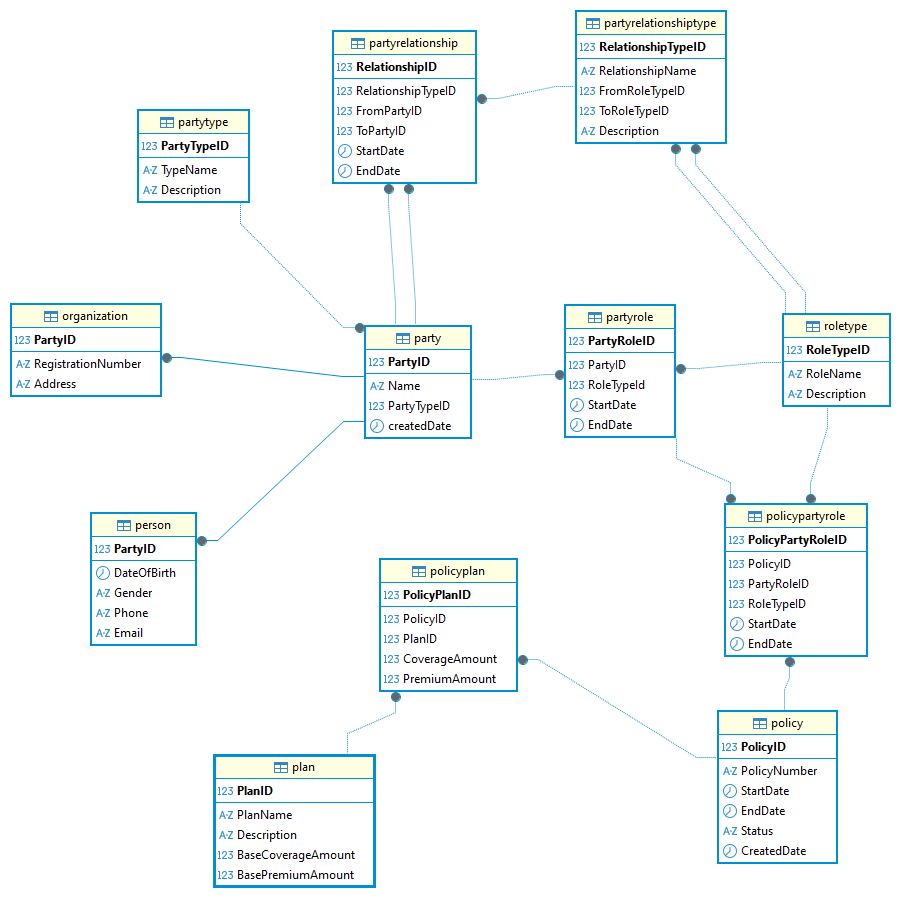

## Plan-Policy Management  
This project is built around the scenario of a **health insurance company**, where policies can consist of multiple plans. It serves as an example implementation of a database schema for such a company using the **Party Role model**.

The goal is to demonstrate how an insurance company can manage:
- Individuals and organizations(Parties)
- Their dynamic roles (e.g., policyholder, Agent, insurer, insuree)
- Relationship between these roles
- Insurance policies and associated plans 

We can add more required tables to attain granular data.  
---
## The schema models various core concepts:
- **Parties** (Individuals, organizations, group)
- **Roles** they play (e.g., Policyholder, Agent, dependent)
- **Relationships** between parties (e.g., Agent manages Policyholder)
- **Policy and Plan associations** (There can be different policies and they have many plans)
- **Extended party details** (person and organization)

---

## Tables and Relationships

|     Table                 |                       Purpose                                     |
|---------------------------|--------------------------------------------------------------------
|   `PartyType`             | Defines types of parties (e.g., Person, Organization or Groups)   |
|   `Party`                 | Main entity table for parties                                     |
|   `RoleType`              | Defines roles parties can play (e.g., policyholder, agent)        |
|   `PartyRole`             | Assigns roles to partie with time tracking                        |
|   `PartyRelationshipType` | Defines types of relationship between party roles                 |
|   `PartyRelationship`     | Captures specific relationships between two parties               |
|   `Policy`                | Insurance policies with dates and status                          |
|   `Plan`                  | Policy plans                                                      |
|   `PolicyPlan`            | Associates policies with plans                                    | 
|   `PolicyPartyrole`       | Links policies to party roles (e.g., an Agent or Policyholder)    |
|   `Person`                | Person-specific data (e.g., DOB, Gender)                          | 
|   `Organization`          | Organization-specific data (e.g., Address, registration number)   |

--- 

## Here's the ER Diagram:



## Sample Queries
You can run sample `SELECT` queries to inspect data and verify relationships:

```sql
-- Get all parties with their types

SELECT p.partyid, p.name, pt.typename FROM party p 
JOIN partytype on p.partytypeid = pt.partytypeid;

-- see party roles
SELECT * FROM partroles;

-- policy and its associated plans
SELECT p.policynumber, pl.planname FROM policy p
JOIN policyplan pp on p.policyid = pp.policyid
JOIN plan pl on pp.planid = pl.planid;
